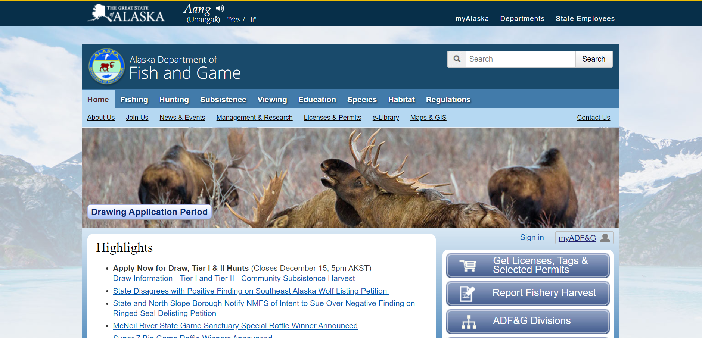
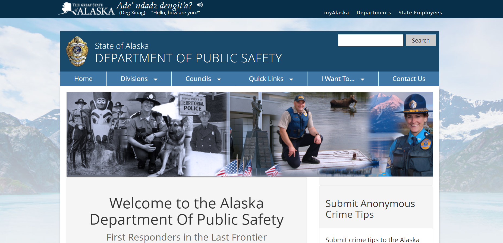

# DH110-Assignment 09
# Alaska's Department of Fish and Game Website UX Project By Jovany Pompa 
## Introduction
The purpose of my project is to analyze and improve design features found on Alaska's Department of Fish and Game website. I chose to evaluate Alaska's Department of Fish and Game website because it is a vital resource for both people who live within the state and people who plan on visiting the state in the future. I recently visited Alaska and obtained all my information regarding wildlife by asking local shop owners within the city. Had I known that the department's website was accessible to me I would have been able to answer all my questions by looking online. Alaska's Department of Fish and Game website allows a person to plan out outdoor adventures, while also informing readers on the latest news and information regarding wildlife. Ultimately, the goal of this project was to provide improved features that made information on the Department of Fish and Game website more efficient and accessible to locals and tourists. 
## Design Statement
After a series of evaluations and testing I determined that Alaska’s Department of Fish and Game website could be improved in two areas. The first area being resource pages for wildlife viewing locations. These pages within the site are not easily accessible to the user and for someone who’s both unfamiliar with the site and does not have a lot of time to navigate through the webpage, finding out where and when they can view specific wildlife can be difficult and time consuming. The second area is the department’s Wildlife Encounter Report Form page section. The Wildlife Encounter Report Form is typically used in wildlife emergency situations and therefore, should be able to be accessed quickly and easily. So, I think it is important that this form is clearly visible and accessible to any user who is in a wildlife emergency. 
## Competitor Analysis
The first step I completed for the project included conducting heuristic evaluations for both Alaska’s Department of Fish and Game and Alaska’s Department of Public Safety. This was completed in order to compare functionality problems, which ultimately assisted me with determining which features benefited the user more. The main heuristic issues in Alaska’s Department of Fish and Game website were helping users recognize, diagnose, and recover from errors, Consistency and standards, and matching between the system and the real world. The main heuristic issues in Alaska’s Department of Public Safety website included visibility of system status, error prevention, and recognition rather than recall. Further Information regarding the evaluations can be found <a href="https://github.com/Jopompa/DH110-JovanyPompa/tree/main/Alaska"> here </a>. 

Alaska's Department of Fish and Game: 

Alaska's Department of Public Safety: 

### Usability Testing
After conducting the heuristic evaluations I then conducted a pilot usability test with another user to measure the effectiveness, efficiency and satisfaction experienced when navigating through the website. I had the user complete three tasks, which included signing up for email notifications from Alaska’s Wildlife Conservation, reporting a wildlife encounter with a predetermined location, and going to the tips and safety page for viewing in Alaska. After the usability test was completed I found that the webpages aesthetic severely slowed down the efficiency of the user when completing the tasks. I used these results to help me determine which features of the website could be improved on. Further information about the pilot usability test can be found <a href="https://github.com/Jopompa/assignment02"> here </a> 
## User Research - Contextual Inquiry
After conducting the usability test I dove deeper into trying to understand the context of use that is created by users when on the website, so I conducted further user research to help explore the goals, problems, and contexts of the users. This allowed me to understand how certain design features are better than others for the targeted audience. Users are more satisfied with short descriptions and a simple aesthetic on the Fish and Game website. Having short descriptions or tabs of where further information can be found is a plus being that users without any knowledge of Alaska often navigate the web page. More information about the contextual inquiry can be found <a href="https://github.com/Jopompa/DH110-JovanyPompa/tree/main/assignment%2003"> here </a>
## UX Storytelling
Developing two personas and scenarios was the next critical step in the process of completing my project. By creating these personas and scenarios I was able to get a deeper understanding of how and why users navigate through the website in the first place. The first user was a young outgoing girl named Brianna who enjoyed planning her next adventure but was restricted in time being that she is a full time worker and mom, efficiency was her main concern. Zinnia was an older lady who enjoyed the outdoors but was always the person to make sure that any out of the norm wildlife scene was reported to the authorities, quick accessibility was her main concern. More detailed personas, empathy maps and scenarios of both Brianna and Zinnia can be found <a href="https://github.com/Jopompa/Assignment-04/blob/main/README.md"> here </a>

Brianna's Persona

Zinnia's Persona

## Low-Fidelity Prototype 
Creating a low-fidelity prototype allowed me to visualize how the interface design would look and how the user would interact with the web page. With a user centric design in mind I created wireframe designs for two tasks, one being finding where and when to view black bears and the second being finding and filling out the Wildlife Encounter Report Form. Then, after the wireframes were complete I created a wireflow by connecting the wireframes using arrows. Allowing the test user to mentally go through the prototype. Unfortunately, after creating the wireflow on paper I realized that the prototype was too big to manage physically, this may have increased the cognitive load on the user which may have increased the efficiency and decreased the perceived accessibility of certain features on the webpage. An illustration of the wireframes and low-fidelity prototype can be found <a href="https://github.com/Jopompa/Assignment-05/blob/main/README.md"> here </a>

### Graphic Design Element Variation
After I created the low-fidelity prototype I then worked on creating multiple different design element variations for the department's web page. The design elements I worked on included the typography, shape and color variation of the website. To do this I digitized the wireframes I had manually illustrated on Figma. Then after creating multiple design element variations and deciding on a final interface design I conducted an impression test to test the look and feel of the website. A detailed analysis of this interface design process can be found <a href="https://github.com/Jopompa/Assignment-06/blob/main/README.md"> here </a> 

## High-Fidelity Prototype 
After testing and altering my low-fidelity prototype I then had to create a revised prototype that would demonstrate more polished design artifacts. This part of the project took a turn for me because after submitting my prototype with revised design elements, it was determined that the frame size of the prototype did not align properly with required elements. So, I changed the layout of the prototype to fit a mobile device as opposed a desktop screen. This made me re-evaluate many interface design elements such as the amount of content provided, button layout, and click command options. The revised high-fidelity prototype process can be found <a href="https://github.com/Jopompa/Assignment-07/blob/main/README.md"> here </a>. The interactive prototype can be found <a href="https://www.figma.com/proto/xcE8uYadsSKRI0JRrVU0fS/Interface-Design?scaling=min-zoom&page-id=0%3A1&starting-point-node-id=46%3A2&node-id=46%3A2"> here </a>

## Pitch Video 
Pitch Video can be found <a href="https://drive.google.com/file/d/1CrtP7lhvkyxlEo84Ca_osVDup9DDo1pO/view?usp=sharing"> here </a>
  
## Conclusion
After going through this whole process I learned that interface designing involves a lot of technical processes that have to be revised over and over, setting aside more time to develop designs will benefit not only the users but you as the designer as well in that processes are better laid out. In my project I interviewed the same user for multiple methodological processes and this proved to be a setback in the design process. Because although the user is providing valuable feedback, their feedback does not encapsulate a diverse range of user wants and needs. I also learned that when prototyping interface designs small scale frames should be implemented so that the impression test can go smooth, allowing the user to more easily go through the prototype mentally. 

